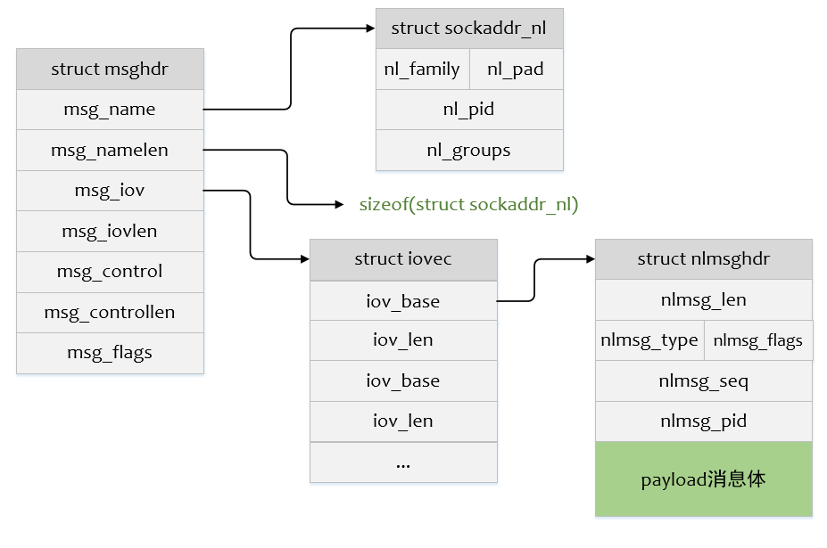

# netlink

> 24年的时候课内祥哥和泉哥在同一时间离职了，我接手了他们负责的ERPS模块。其中有几个机型使用到netlink，读取内核的一些信息。当时没有仔细研究这段代码，一知半解，时至今日，得空来系统学习一下netlink的知识

Netlink是一种特殊的socket，是Linux所特有的，它为用户空间和内核以及内核的有些部分之间提供双向通信通道，是对标准套接字的拓展。Netlink主要用于内核和用户态进程之间的通信，也可以用于用户空间的两个进程通信。（Netlink更多的用于内核通信，进程之间的通信更多的使用Unix域套接字，除非需要用到Netlink的广播特性时）Netlink基于AF_NETLINK地址簇，目前使用Netlink进行应用与内核通信的服务/组件很多，每种Netlink协议通常与一个或一组内核服务/组件相关联。根据Netlink协议的不同，用户发送的消息会流向不同的目的地，如NETLINK_ROUTE用于获取和设置路由与链路信息，NETLINK_KOBJECT_UEVENT用于内核向用户空间的udev进程发送通知等。

一般情况下，用户态和内核态通信会使用传统的通信方式：`ioctl`系统调用、`sysfs`属性文件、`procfs`等，但是这些通信方式都是同步通信，并且都是由用户态主动发起内核态的通信，内核无法主动发起通信。

Netlink是一种异步全双工的通信方式，它支持由内核态主动发起通信，内核为Netlink通信提供了一组特殊的API接口，用户态则基于标准的SOCKET API。因此，使用Netlink通信方式的优点就很明显了：
1、 双向全双工异步传输，支持由内核主动发起传输通信，区别于传统的必须从用户空间出发的单工通信方式；用户空间在等待内核某种触发条件满足时无需轮询，异步接收内核消息即可。
2、 支持组播传输，即内核可以将消息发送给多个接收进程，无需每个进程单独查询。

示例代码位于[netlink_test](../../code/experiments/netlink_test/)

1. 执行`make`构建
2. 加载模块到内核
3. 运行用户态程序

## netlink相关数据结构和接口

### netlink用户态

1. 标准套接字接口`socket`

Netlink是一个面向数据报的服务，**用户态程序通过调用标准的Socket API就可以使用Netlink**提供的强大功能，AF_NETLINK系列提供多个协议子集，每个接口都连接到不同的内核组件并具有不同的消息传递子集。

```c
socket(AF_NETLINK, SOCK_RAW or SOCK_DGRAM, protocol)
// 参数一：套接字协议族，必须是AF_NETLINK或者PF_NETLINK，等价
// 参数二：套接字类型，SOCK_RAW或者SOCK_DGRAM，前者表示原始数据报，推荐
// 参数三：协议类型，可以使用内核已经定义的协议号，获取内核对应的信息，或者自定义
```

内核已经定义的协议号如下

```c
// linux-rpi-6.12.y/include/uapi/linux/netlink.h
#define NETLINK_ROUTE		0	/* Routing/device hook				*/
#define NETLINK_UNUSED		1	/* Unused number				*/
#define NETLINK_USERSOCK	2	/* Reserved for user mode socket protocols 	*/
#define NETLINK_FIREWALL	3	/* Unused number, formerly ip_queue		*/
#define NETLINK_SOCK_DIAG	4	/* socket monitoring				*/
#define NETLINK_NFLOG		5	/* netfilter/iptables ULOG */
#define NETLINK_XFRM		6	/* ipsec */
#define NETLINK_SELINUX		7	/* SELinux event notifications */
#define NETLINK_ISCSI		8	/* Open-iSCSI */
#define NETLINK_AUDIT		9	/* auditing */
#define NETLINK_FIB_LOOKUP	10	
#define NETLINK_CONNECTOR	11
#define NETLINK_NETFILTER	12	/* netfilter subsystem */
#define NETLINK_IP6_FW		13
#define NETLINK_DNRTMSG		14	/* DECnet routing messages (obsolete) */
#define NETLINK_KOBJECT_UEVENT	15	/* Kernel messages to userspace */
#define NETLINK_GENERIC		16
/* leave room for NETLINK_DM (DM Events) */
#define NETLINK_SCSITRANSPORT	18	/* SCSI Transports */
#define NETLINK_ECRYPTFS	19
#define NETLINK_RDMA		20
#define NETLINK_CRYPTO		21	/* Crypto layer */
#define NETLINK_SMC		22	/* SMC monitoring */

#define NETLINK_INET_DIAG	NETLINK_SOCK_DIAG

#define MAX_LINKS 32	
```

由此可见，目前使用netlink进行应用与内核通信的服务/组件很多。对于上述协议的用途，比如创建一个上层应用通过使用`NETLINK_ROUTE`协议通信，可以获得内核的路由信息

当然也可以自定义通信协议，但是不能使用已有的协议编号，也不能超过`MAX_LINKS`，**除编写用户态程序之外，还要编写相应的内核模块**

2. `struct sockaddr_nl`结构体

socket创建完毕后，需要调用`bind`函数将netlink套接字绑定到一个特定的地址，或者加入组播组中，绑定时使用到`struct sockaddr_nl`类型变量

```c
// linux-rpi-6.12.y/include/uapi/linux/netlink.h
struct sockaddr_nl {
	__kernel_sa_family_t	nl_family;	/* AF_NETLINK	*/
	unsigned short	nl_pad;		/* zero		*/
	__u32		nl_pid;		/* port ID	*/
	__u32		nl_groups;	/* multicast groups mask */
};
```

- `nl_family`，表示协议族，netlink固定使用AF_NETLINK
- `nl_pid`，类似端口号，**用户态程序一般使用自己的pid**（不用也行，使用一个确定不冲突的值），**内核必须使用0**
- `nl_groups`，组播组，**0表示不加入任何组播组，其余每个32位整数都表示一个组播组**

3. `struct nlmsghdr`结构体

netlink消息由**netlink消息头部（nlmsghdr）**和**有效载荷（payload）**组成。payload根据用户请求类型和内核响应内容的不同而不同

消息头部nlmsghdr定义如下：

```c
// linux-rpi-6.12.y/include/uapi/linux/netlink.h
/**
 * struct nlmsghdr - fixed format metadata header of Netlink messages
 * @nlmsg_len:   Length of message including header     包含hdr+payload的长度
 * @nlmsg_type:  Message content type                   消息状态
 * @nlmsg_flags: Additional flags                       标志
 * @nlmsg_seq:   Sequence number                        序列号，用户设置，可以用来追踪请求
 * @nlmsg_pid:   Sending process port ID                发送的端口号，内核发送设置0，用户态发送设置为socket bind的端口号
 */
struct nlmsghdr {
	__u32		nlmsg_len;
	__u16		nlmsg_type;
	__u16		nlmsg_flags;
	__u32		nlmsg_seq;
	__u32		nlmsg_pid;
};
```

其中`nlmsg_type`包含四种四种通用消息类型，同样可以额外定义自己的消息类型

```c
// linux-rpi-6.12.y/include/uapi/linux/netlink.h

#define NLMSG_NOOP		0x1	/* Nothing.		*/
#define NLMSG_ERROR		0x2	/* Error		*/
#define NLMSG_DONE		0x3	/* End of a dump	*/
#define NLMSG_OVERRUN		0x4	/* Data lost		*/

#define NLMSG_MIN_TYPE		0x10	/* < 0x10: reserved control messages */
```

此外，内核提供了一系列宏，方便创建或访问netlink数据报文，**访问netlink msg缓冲区时应尽量使用这些标准宏**

```c
// linux-rpi-6.12.y/include/uapi/linux/netlink.h
#define NLMSG_ALIGNTO	4U
#define NLMSG_ALIGN(len) ( ((len)+NLMSG_ALIGNTO-1) & ~(NLMSG_ALIGNTO-1) )
#define NLMSG_HDRLEN	 ((int) NLMSG_ALIGN(sizeof(struct nlmsghdr)))
#define NLMSG_LENGTH(len) ((len) + NLMSG_HDRLEN)

#define NLMSG_SPACE(len) NLMSG_ALIGN(NLMSG_LENGTH(len))                     // 传入payload len，得到包含头部的长度
#define NLMSG_DATA(nlh)  ((void *)(((char *)nlh) + NLMSG_HDRLEN))           // 传入指向nlmsghdr的指针，指向payload的指针
#define NLMSG_NEXT(nlh,len)	 ((len) -= NLMSG_ALIGN((nlh)->nlmsg_len), \
				  (struct nlmsghdr *)(((char *)(nlh)) + \
				  NLMSG_ALIGN((nlh)->nlmsg_len)))
#define NLMSG_OK(nlh,len) ((len) >= (int)sizeof(struct nlmsghdr) && \
			   (nlh)->nlmsg_len >= sizeof(struct nlmsghdr) && \
			   (nlh)->nlmsg_len <= (len))
#define NLMSG_PAYLOAD(nlh,len) ((nlh)->nlmsg_len - NLMSG_SPACE((len)))
```

4. `struct msghdr`结构体

用户态程序向内核发送消息，基于标准套接字的消息结构体`struct msghdr`

```c
// linux-rpi-6.12.y/include/linux/socket.h

// for kernel
struct msghdr {
	void		*msg_name;	/* ptr to socket address structure */
	int		msg_namelen;	/* size of socket address structure */

	int		msg_inq;	/* output, data left in socket */

	struct iov_iter	msg_iter;	/* data */

	/*
	 * Ancillary data. msg_control_user is the user buffer used for the
	 * recv* side when msg_control_is_user is set, msg_control is the kernel
	 * buffer used for all other cases.
	 */
	union {
		void		*msg_control;
		void __user	*msg_control_user;
	};
	bool		msg_control_is_user : 1;
	bool		msg_get_inq : 1;/* return INQ after receive */
	unsigned int	msg_flags;	/* flags on received message */
	__kernel_size_t	msg_controllen;	/* ancillary data buffer length */
	struct kiocb	*msg_iocb;	/* ptr to iocb for async requests */
	struct ubuf_info *msg_ubuf;
	int (*sg_from_iter)(struct sk_buff *skb,
			    struct iov_iter *from, size_t length);
};

// for kernel analyze user msghdr
struct user_msghdr {
	void		__user *msg_name;	/* ptr to socket address structure */
	int		msg_namelen;		/* size of socket address structure */
	struct iovec	__user *msg_iov;	/* scatter/gather array */
	__kernel_size_t	msg_iovlen;		/* # elements in msg_iov */
	void		__user *msg_control;	/* ancillary data */
	__kernel_size_t	msg_controllen;		/* ancillary data buffer length */
	unsigned int	msg_flags;		/* flags on received message */
};
```

用户态中对应的是`struct user_msghdr`，以上是在内核中的定义，同用户态程序使用的`struct msghdr`

- `msg_name`：接收消息的socket通信地址结构体指针（`struct sockaddr_nl`）
- `msg_namelen`：套接字通信地址结构体的大小
- `msg_iov`：存放消息体的缓冲区数组地址
- `msg_iovlen`：缓冲区个数
- `msg_flags`：接收消息的标志

以上几个结构体的关系大致如下：



5. `sendmsg`发送消息

组织完标准消息体后，调用`sendmsg`标准套接字接口即可发送消息到内核。`sendmsg`可以发送多种类型数据，支持一次发送多个数据块（scatter/gather I/O）

```c
ssize_t sendmsg(int sockfd, const struct msghdr *msg, int flags);
```

### netlink内核态

使用自定义的协议号，除了编写用户态程序，内核也要实现对应的驱动

1. 内核创建socket

```c
static inline struct sock *netlink_kernel_create(struct net *net, int unit, struct netlink_kernel_cfg *cfg)
```

- `net`：网络空间名，**默认情况下都是用`init_net`全局变量**
- `unit`：协议号，需要保证和用户态程序使用的一致
- `cfg`：内核netlink结构变量，主要关注回调函数成员`input`

```c
/* optional Netlink kernel configuration parameters */
struct netlink_kernel_cfg {
	unsigned int	groups;
	unsigned int	flags;
	void		(*input)(struct sk_buff *skb);
	struct mutex	*cb_mutex;
	int		(*bind)(struct net *net, int group);
	void		(*unbind)(struct net *net, int group);
	bool		(*compare)(struct net *net, struct sock *sk);
};
```

- `input`成员函数指定回调函数，当**收到用户消息时调用**，调用结束后，用户的`sendmsg`才能返回

2. 内核netlink通信相关操作

内核中不存在绑定、设置非阻塞的概念，只有netlink消息的构建、发送、访问等操作。常用API有

```c
// linux-rpi-6.12.y/include/net/netlink.h

/**
 * nlmsg_new - Allocate a new netlink message
 * @payload: size of the message payload
 * @flags: the type of memory to allocate.
 *
 * Use NLMSG_DEFAULT_SIZE if the size of the payload isn't known
 * and a good default is needed.
 */
static inline struct sk_buff *nlmsg_new(size_t payload, gfp_t flags)    // 申请sk_buff变量空间

/**
 * nlmsg_put - Add a new netlink message to an skb
 * @skb: socket buffer to store message in
 * @portid: netlink PORTID of requesting application
 * @seq: sequence number of message
 * @type: message type
 * @payload: length of message payload
 * @flags: message flags
 *
 * Returns NULL if the tailroom of the skb is insufficient to store
 * the message header and payload.
 */
static inline struct nlmsghdr *nlmsg_put(struct sk_buff *skb, u32 portid, u32 seq,
					 int type, int payload, int flags)                  // 将netlink消息加入到sk buffer中
```

涉及到结构体`struct sk_buff`，用于管理套接字缓冲区，这里不详细展开。介绍一个宏`NETLINK_CB(sk_buff*)`，用于获取缓冲区中的元数据，比如`NETLINK_CB(sk_buff*).dst_group`，为发送消息的组播组

内核发送netlink消息API如下，

```c
// linux-rpi-6.12.y/include/net/netlink.h

/**
 * nlmsg_unicast - unicast a netlink message
 * @sk: netlink socket to spread message to
 * @skb: netlink message as socket buffer
 * @portid: netlink portid of the destination socket
 */
static inline int nlmsg_unicast(struct sock *sk, struct sk_buff *skb, u32 portid)
```