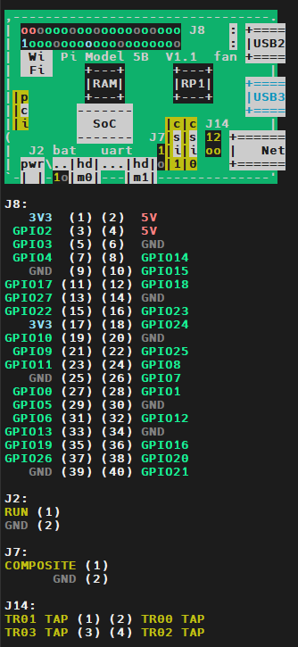

# platform device driver

本章介绍平台设备驱动

首先一个问题是，什么是平台设备驱动？前边已经实现的字符设备驱动，只需要调用`open()`来打开对应的设备文件，就可以通过`file_operations`文件操作接口来控制硬件

但是这种方式存在一个问题，就是设备信息和驱动代码耦合在一块了。在未来的驱动程序中，各种硬件寄存器地址随处可见，一旦硬件信息发生变化，代码就需要修改，这样是很麻烦的

为了解决这种问题，linux提出了设备驱动模型，引入总线概念来分离驱动代码和设备信息

对于I2C、SPI、USB这些常见的物理总线，内核会自动创建与之相对应的驱动总线，但还存在很多结构简单的设备，没有对应物理总线，例如rtc、led、蜂鸣器等，**为了使这些设备也能够遵循设备驱动模型，内核引入了虚拟总线——平台总线（platform bus）**

## 平台设备驱动简介

连接到平台总线上的设备，需要被**静态发现**而不是被动态探测，例如写到设备树里

**平台设备驱动程序负责在设备模型核心中实例化并注册`platform_driver`数据结构实例**，驱动提供`probe()`和`remove()`方法，用于匹配到设备、设备离开时的回调；**`probe`函数在总线驱动程序和设备匹配上时被调用**，在其中一般进行设备的初始化

平台驱动程序需要使用`platform_driver_register()`函数来将驱动程序注册到平台核心，使用`platform_driver_unregister()`函数来注销

当模块被加载时，使用`platform_driver_register`将自己注册到平台总线驱动中，当该驱动`struct of_device_id`数据结构中的某个`compatible`属性值和设备树（DT）中的某个`compatible`完全匹配时，驱动的`probe`函数将被调用。

因此需要在模块的`init`中调用驱动注册

此外可以**使用`module_platform_driver()`宏，该宏会调换掉`module_init`和`module_exit`。对于不需要在init和exit中进行复杂操作的设备驱动，可以简化代码**

### 相关数据结构和API

`struct of_device_id`定义在`include/linux/mod_devicetable.h`中，用于驱动匹配设备树中的设备，其中最重要的是`compatible`属性，是一个字符串，需要和设备树中设备的`compitable`属性完全匹配

```c
struct of_device_id{
    char name[32];
    char type[32];
    char compatible[128];
    const void *data;
};
```

`MODULE_DEVICE_TABLE(type, table_name)`用于声明设备驱动和硬件设备之间的匹配表，帮助内核在加载模块时自动关联驱动程序和设备，使用**值`of`表示设备树匹配表类型**

`platform_driver_register`函数使用`struct platform_driver`数据结构，其中比较重要的成员：

```c
struct platform_driver{
    int (*probe)(struct platform_device*);
    int (*remove)(struct platform_device*);
    void (*shutdown)(struct platform_device*);
    /* 以下两个支持低功率管理 */
    int (*suspend)(struct platform_device*, pm_message_t);
    int (*resume)(struct platform_device*);

    struct device_driver driver;
}
```

其中`struct device_driver`用于表示一个设备驱动程序，比较重要的有如下，我们在代码中也初始化了这几个属性

```c
struct device_driver{
    const char *name;
    struct module   *owner;     // 模块所属（如 THIS_MODULE）
    const struct of_device_id *of_match_table;  // 设备匹配表
};
```

再看看`module_platform_driver()`宏，展开后等价于：

```c
static int __init my_driver_init(void) {
    return platform_driver_register(&my_platform_driver);
}

static void __exit my_driver_exit(void) {
    platform_driver_unregister(&my_platform_driver);
}

module_init(my_driver_init);
module_exit(my_driver_exit);
```

会自动关联init和exit函数，进行驱动的注册和注销，可以大大简化代码

### 实验代码

实验代码位于路径[03_platform_dev_drv](../../code/examples/03_platform_dev_drv/)

尴尬的是需要更新设备树进行编译，再验证，工位的电脑应该是不支持我下载源码等操作，回家再看看~

TODO

## 硬件相关知识

在之后的开发中，需要操作不同的设备，比如LED，按钮，I2C设备等，因此有必要了解硬件相关知识

首先是**引脚**，引脚表示电信号的物理输入/输出接线，每个引脚（也叫焊点）都有制造商提供的引脚名称，在原理图中可以查看不同引脚的名称。

一般处理器功能很丰富，但引脚数量是有限的，虽然单个引脚在特定时刻只能完成单一功能，但我们可以内部对其配置，使其完成不通的功能，称为**引脚复用**

笔者使用的开发板为树莓派5，在终端输入`pinout`可查看引脚简略信息，输出如下，有颜色的图片单独放出来，比较好区分引脚信息

```bash
cai@raspberrypi:~ $ pinout
Description        : Raspberry Pi 5B rev 1.1
Revision           : d04171
SoC                : BCM2712
RAM                : 8GB
Storage            : MicroSD
USB ports          : 4 (of which 2 USB3)
Ethernet ports     : 1 (1000Mbps max. speed)
Wi-fi              : True
Bluetooth          : True
Camera ports (CSI) : 2
Display ports (DSI): 2

For further information, please refer to https://pinout.xyz/
```



## 引脚控制子系统

在旧的Linux引脚复用代码中，每个体系结构都有自己的引脚复用代码，引脚复用功能必须在SoC级别实现，且设备驱动程序无法调用

新的Pinctrl子系统目的在于解决这个问题，实现位于`drivers/pinctrl`中，提供如下功能：

